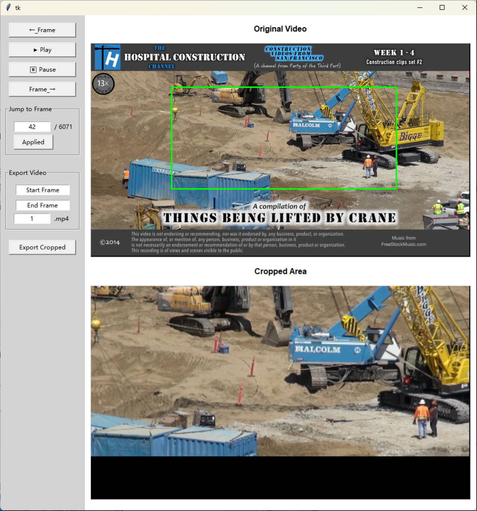
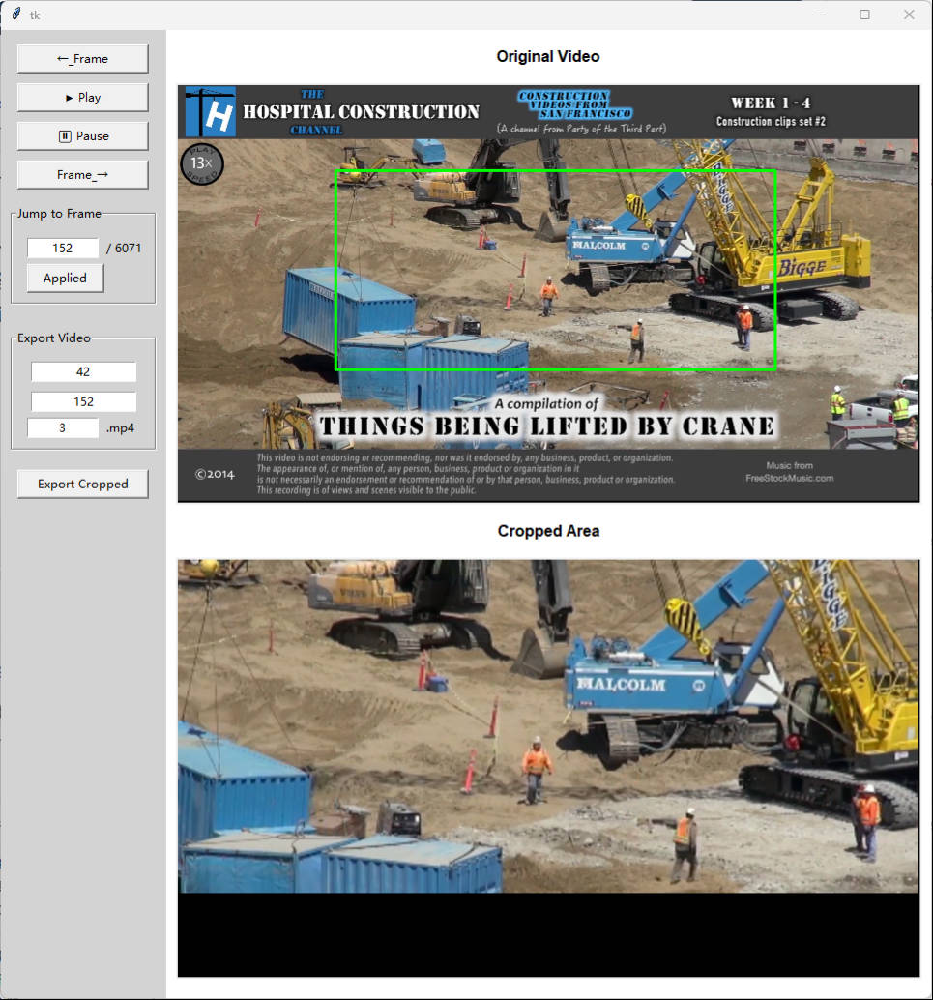

# Video Processing Tool

[TOC]

## Project Introduction

This project is used to finely extract video clips of specific areas. The purpose of making this tool is to create a benchmarking dataset for onsite tracking algorithm. The following details this project.

+ Folder: `data`——This folder is used to store all the video clips to be processed. These video clips usually have the following problems: shooting angle change, lens shaking, brightness change, etc.\[Because the video file is too large to upload to GitHub, this folder is empty.\]
+ Folder: `result`——This folder is used to store the cropped output results.
+ `item.txt`: Used to store the number of the video being processed.
+ `videoProcessingTools.py`: This file is the core of processing video clips. It is based on two different libraries. **Tkinter** is responsible for the development of the interactive interface; **OpenCV** is responsible for extracting video clips of the specific area. 

## Project Interface

+ Green bounding box is the region needed to be cropped.
+ Content between the two frames is the video clip to be extracted.

The cropping result of the specific area in **frame 42**:

The cropping result of the specific area in **frame 152**:

